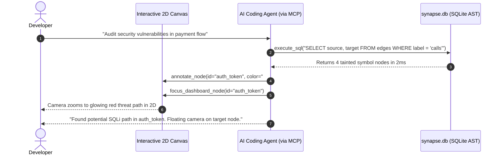

# Inside Go-Synapse: How a 2ms Local SQLite AST Database Supercharges AI Agents via MCP

**Category**: AI Infrastructure / Model Context Protocol (MCP) / Static Analysis  
**Target Keywords**: Model Context Protocol MCP, SQLite AST database, AI code auditing, Go-Synapse, tree-sitter parser  
**Reading Time**: 7 Minutes  

---

## Introduction

As AI coding agents transition from simple single-file autocomplete tools to autonomous software engineers capable of refactoring multi-thousand-line repositories, a critical bottleneck has emerged: **How do agents query codebase structure fast enough without consuming millions of context tokens?**

Reading raw source files sequentially is slow, token-expensive, and prone to context window truncation.

**Go-Synapse** solves this by converting your entire codebase into a high-performance **SQLite Relational AST Database (`synapse.db`)** exposed directly to AI agents via the **Model Context Protocol (MCP)**.

---

## 1. The Relational AST Schema Architecture

When Go-Synapse scans a repository, it utilizes C-Tree-sitter bindings to construct a relational schema of all code symbols, files, imports, calls, and type definitions.

```
┌────────────────────────────────────────────────────────────────────────┐
│                        SYNAPSE.DB RELATIONAL AST                       │
├──────────────────┬──────────────────┬─────────────────┬────────────────┤
│  nodes           │  edges           │  files          │  ssa_blocks    │
│  - id            │  - id            │  - file_path    │  - id          │
│  - label         │  - source        │  - hash         │  - function_id │
│  - node_type     │  - target        │                 │  - block_index │
│  - file_path     │  - label         │                 │  - file_path   │
│  - start_line    │  - line_number   │                 │                │
└──────────────────┴──────────────────┴─────────────────┴────────────────┘
```

### Relational Efficiency vs. Raw File Scanning

| Query Type | Traditional LLM Raw File Approach | Go-Synapse SQLite AST via MCP |
| :--- | :--- | :--- |
| **Find callers of `ProcessPayment()`** | Scans 100+ files (~50,000 tokens, 10-20 sec) | `SELECT source FROM edges WHERE target = 'ProcessPayment'` (**2ms**) |
| **Trace cyclic package imports** | Multi-step prompt loop (High hallucination risk) | Recursive SQL CTE query (**3ms**) |
| **Identify unused/dead functions** | Full workspace re-indexing | BFS reachability query over AST table (**4ms**) |

---

## 2. Model Context Protocol (MCP) Integration

Go-Synapse acts as a native **MCP Server**. AI agents (such as Claude Code, AntiGravity, Cursor, or custom LLM scripts) communicate with Go-Synapse using standard JSON-RPC over `stdio` or HTTP loopback.

### Key MCP Tools Provided by Go-Synapse:

1. `execute_sql(query)`: Executes relational SQL queries against `synapse.db` in under 2ms.
2. `annotate_node(node_id, color, badge)`: Allows the AI agent to color-code symbols on the user's 2D visual canvas.
3. `focus_dashboard_node(node_id)`: Moves the developer's camera view to the exact component under audit.
4. `open_file_in_editor(filepath, line)`: Opens the file directly in the developer's IDE at the precise line number.

---

## 3. Bi-Directional AI-Human Co-Pilot Flow

Because Go-Synapse connects the SQLite AST database to the Interactive 2D visual canvas in real-time, the AI agent and human engineer operate in complete visual alignment:



---

## 4. Zero Data Exfiltration (100% Local Loopback Shield)

Enterprise security requires strict data privacy. Go-Synapse runs entirely on local loopback (`127.0.0.1:8080`):

- **No Remote Telemetry**: Zero analytics or external server calls.
- **Tree-sitter Local Parsing**: Code stays on the machine at all times.
- **Cryptographic Certificate Verification**: RSA-2048 keys sign `audit_certificate.json` to verify database checksum integrity and flag code drift.

---

## Conclusion

The combination of SQLite AST schemas and Model Context Protocol transforms AI code auditing from a slow, expensive prompt-engineering task into a sub-millisecond database query.

With Go-Synapse, AI agents spend less time reading raw file noise and more time writing precise, verified code.
